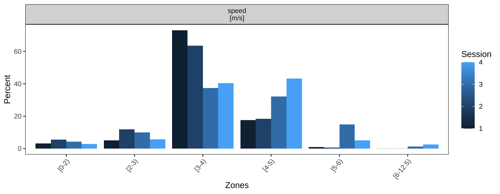
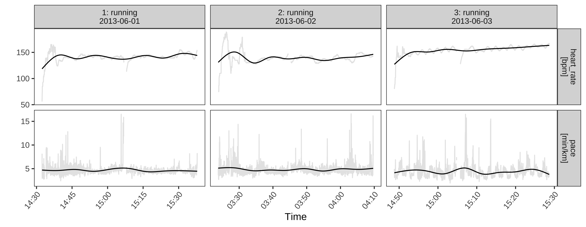
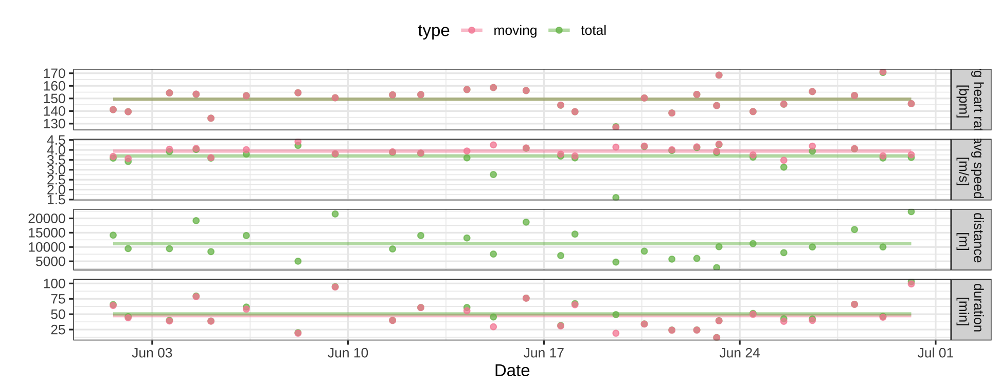

```{r setup, include=FALSE}
options(htmltools.dir.version = FALSE)
knitr::opts_chunk$set(
  fig.width=9, fig.height=3.5, fig.retina=3,
  out.width = "100%",
  cache = FALSE,
  echo = TRUE,
  message = FALSE, 
  warning = FALSE,
  hiline = TRUE
)

df <- readRDS('./nba.rds')
```


## Grammar of graphics: layers of a plot

- Data

- Geoms

- Aesthetic mappings

- Facets


### Data

- The underlying data frame.

- Think rows and columns.


### Geoms

- Shapes to represent the data.

- Individual geoms use one shape per row.

- Group geoms use multiple rows to create a shape.

### Aesthetic mappings

- Map between the aesthetic properties of a geom and column of the data.

### Facets

- Also called small multiples.

- Slice the rows into multiple sub populations.

### Identify the components of the grammar of graphics

```{r, echo=FALSE}
library(ggplot2)

## TODO: create a plot of assists vs turnovers.
plt <- ggplot(data=df, aes(x=AST, 
                    y=TOV, 
                    color=Playoff, 
                    shape=Playoff)) + 
  geom_point() + 
  labs(title="Turnovers vs. Assists",
       subtitle="2017/18 Regular Season",
       x="Assists",
       y="Turnovers")

plt
  
```


##



### Identify the components (2)




##




### Scatter plot: Data

- Call the `ggplot` function and pass in a data frame.
```{r}
ggplot(df)
```

### Scatter plot: Aesthetic mappings

- Pass the aes function with the mapping as a second argument.

```{r}
ggplot(df, aes(x=AST, y=TOV))
```
### Scatter plot: Geoms

- Add a layer to use one point to represent one row.


```{r}
ggplot(df, aes(x=AST, y=TOV)) + geom_point()
```

## More mappings:

- Shape and color
```{r}
ggplot(df, aes(x=AST, y=TOV, color=Playoff, shape=Playoff)) + 
  geom_point()

```

<!-- ### How to make a barchart -->

<!-- # ```{r} -->
<!-- # library(ggplot2) -->
<!-- #  -->
<!-- # df %>%  -->
<!-- #   arrange(-PTS) %>%  -->
<!-- #   head(5) %>%  -->
<!-- #   ggplot(aes(PTS, Team, fill=Conference)) + -->
<!-- #   geom_col()  -->
<!-- # ``` -->


### Lab 2

- Create a plot to understand the relationship between two pointers made and three pointers made.
- Think about the data and the aesthetic mappings that you want.
- Put it in an Rmarkdown file.
