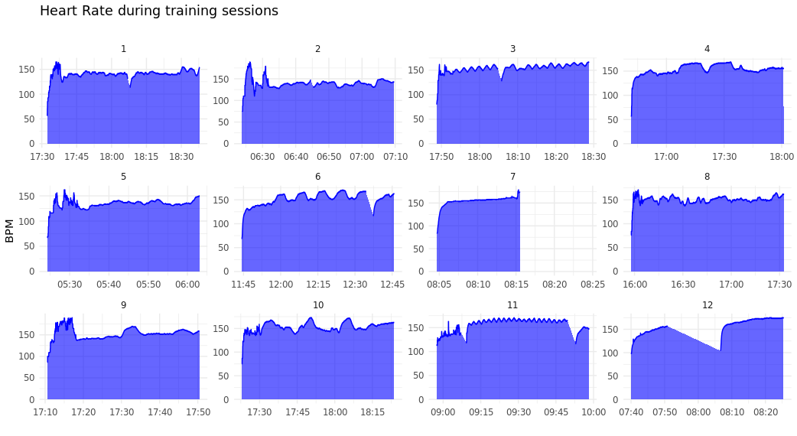

```{r setup, include=FALSE}
options(htmltools.dir.version = FALSE)
knitr::opts_chunk$set(
  fig.width=9, fig.height=3.5, fig.retina=3,
  out.width = "100%",
  cache = FALSE,
  echo = TRUE,
  message = FALSE, 
  warning = FALSE,
  hiline = TRUE
)
```


## Typography

Text can be **bold**, _italic_, ~~strikethrough~~, or `inline code`.


```markdown
 *italic*
 **bold**
 ~~strikethrough~~
 `inline code`
[link](https://example.com)
```
### Code Blocks

#### R Code

```{r eval=FALSE}
ggplot(gapminder) +
  aes(x = gdpPercap, y = lifeExp, size = pop, color = country) +
  geom_point() +
  facet_wrap(~year)
```


## Tables

```{r}
knitr::kable(head(mtcars), format = 'html')
```


##

```{r eval=requireNamespace("DT", quietly=TRUE)}
DT::datatable(head(mtcars), fillContainer = FALSE, options = list(pageLength = 4))
```


##

::: {.pull-left}
#### Here is an unordered list:

*   Item foo
*   Item bar
*   Item baz
*   Item zip
:::

#### The markdown is:

::: {.pull-left}
```markdown
 * Item foo
 * Item bar
```
:::


##

::: {.pull-left}

#### And an ordered list:
```markdown
1.  Item one
1.  Item two
1.  Item three
1.  Item four
```
:::

::: {.pull-right}

#### And an ordered list:

1.  Item one
1.  Item two
1.  Item three
1.  Item four
:::


### And a nested list:

- level 1 item
  - level 2 item
  - level 2 item
    - level 3 item
    - level 3 item
- level 1 item
  - level 2 item
  - level 2 item
  - level 2 item
- level 1 item
  - level 2 item
  - level 2 item
- level 1 item


### Nesting an ol in ul in an ol

- level 1 item (ul)
  1. level 2 item (ol)
  1. level 2 item (ol)
    - level 3 item (ul)
    - level 3 item (ul)
- level 1 item (ul)
  1. level 2 item (ol)
  1. level 2 item (ol)
    - level 3 item (ul)
    - level 3 item (ul)
  1. level 4 item (ol)
  1. level 4 item (ol)
    - level 3 item (ul)
    - level 3 item (ul)
- level 1 item (ul)

## Images



## Data Visualization

- ggplot is great for fast exploratory plots.
- It has great tools for creating plots for communicating your results.
- In this scenario, the emphasis should be on the __story__ you are trying to tell.

## Themes

- Branding [example from the BBC](https://bbc.github.io/rcookbook/#make_a_line_chart)


## Default theme

- Is called theme_grey()

```{r echo=FALSE, warning=FALSE, message=FALSE}
library(dplyr)
library(ggplot2)

nfl_stand <- readRDS('./nfl_stand.rds')

diff_df <- readRDS('./diff_df.rds')
```

```{r}
ggplot(diff_df, aes(x = pts_diff, y = win_pct)) +
  geom_point() + 
  theme_grey()
```

- Grey panel background
- white grid lines

## GGthemes

- package with some well known themes:
  - theme_fivethirtyeight()
  - theme_economist()
  
## Theme elements

- theme elements can be lines, text, etc.
- To specify an option, you use the corresponding element.

## Centering titles and subtitles

- When styling text, use element_text.

```{r eval=FALSE}
theme(
  plot.title=element_text(hjust=.5)
)
```


## Grids

- When styling lines, use element_line

```{r eval=FALSE}

theme(
  panel.grid.major=element_line(color="red")
)

```


## Labels
```{r}
plot <- nfl_stand %>% 
  mutate(
    color = case_when(
      season < 2020 & seed <= 6 ~ "blue",
      season == 2020 & seed <= 7 ~ "blue",
      TRUE ~  "red"
    )
  ) %>% 
  ggplot(aes(x = as.numeric(pts_diff), y = win_pct)) +
  geom_vline(xintercept = 0, size = 0.75, color = "#737373") +
  geom_point(
    aes(color = color),
    size = 3, alpha = 0.8
    ) +
  scale_color_identity() +
  labs(x = "Points Differential", y = "Win Percent",
       title = "Playoff teams typically have a positive point differential",
       subtitle = "Data through week 15 of the 2020 NFL Season",
       caption = "Plot: @thomas_mock | Data: ESPN")
```

##

```{r}
plot
```


## Scales

```{r}
plt_scales <- nfl_stand %>% 
  mutate(
    color = case_when(
      season < 2020 & seed <= 6 ~ "blue",
      season == 2020 & seed <= 7 ~ "blue",
      TRUE ~  "red"
    )
  ) %>% 
  ggplot(aes(x = as.numeric(pts_diff), y = win_pct)) +
  geom_vline(xintercept = 0, size = 0.75, color = "#737373") +
  geom_point(aes(color=color)) + 
  scale_color_identity()+
  scale_y_continuous(
    labels = scales::percent_format(accuracy = 1),
    breaks = seq(.0, 1, by = .10)
    ) +
  scale_x_continuous(
    breaks = seq(-200, 250, by = 50)
  ) +
  labs(x = "Points Differential", y = "Win Percent",
       title = "Playoff teams typically have a positive point differential",
       subtitle = "Data through week 15 of the 2020 NFL Season",
       caption = "Plot: @thomas_mock | Data: ESPN")
```


##

```{r}
plt_scales
```


## Experiment with themes

```{r}
if (requireNamespace("ggthemes", quietly = TRUE)) {
  plot + ggthemes::theme_economist()
} else {
  plot + theme_minimal()
}
```


## Final plot
```{r}
playoff_label_scatter <- tibble::tibble(
  pts_diff = c(25,-125), y = c(0.3, 0.8), 
  label = c("Missed<br>Playoffs", "Made<br>Playoffs"),
  color = c("#D50A0A", "#013369")
)


playoff_diff_plot <- nfl_stand %>% 
  mutate(
    pts_diff=as.numeric(pts_diff),
    color = case_when(
      season < 2020 & seed <= 6 ~ "#013369",
      season == 2020 & seed <= 7 ~ "#013369",
      TRUE ~  "#D50A0A"
    )
  ) %>% 
  ggplot(aes(x = pts_diff, y = win_pct)) +
  geom_vline(xintercept = 0, size = 0.75, color = "#737373") +
  geom_hline(yintercept = 0, size = 0.75, color = "#737373") +
  geom_point(
    aes(color = color),
    size = 3, alpha = 0.8
    ) +
  # ggtext::geom_richtext(
  #   data = playoff_label_scatter,
  #   aes(x = pts_diff, y = y, label = label, color = color),
  #   fill = "#f0f0f0", label.color = NA, # remove background and outline
  #   label.padding = grid::unit(rep(0, 4), "pt"), # remove padding
  #   family = "Chivo", hjust = 0.1, fontface = "bold",
  #   size = 8
  # ) +
  scale_color_identity() +
  labs(x = "Points Differential", y = "Win Percent",
       title = "Playoff teams typically have a positive point differential",
       subtitle = "Data through week 15 of the 2020 NFL Season",
       caption = stringr::str_to_upper("Plot: @thomas_mock | Data: ESPN")) +
  scale_y_continuous(
    labels = scales::percent_format(accuracy = 1),
    breaks = seq(.0, 1, by = .10)
    ) +
  scale_x_continuous(
    breaks = seq(-200, 250, by = 50)
  ) + 
  theme(plot.subtitle=element_text(hjust=.5))
```
